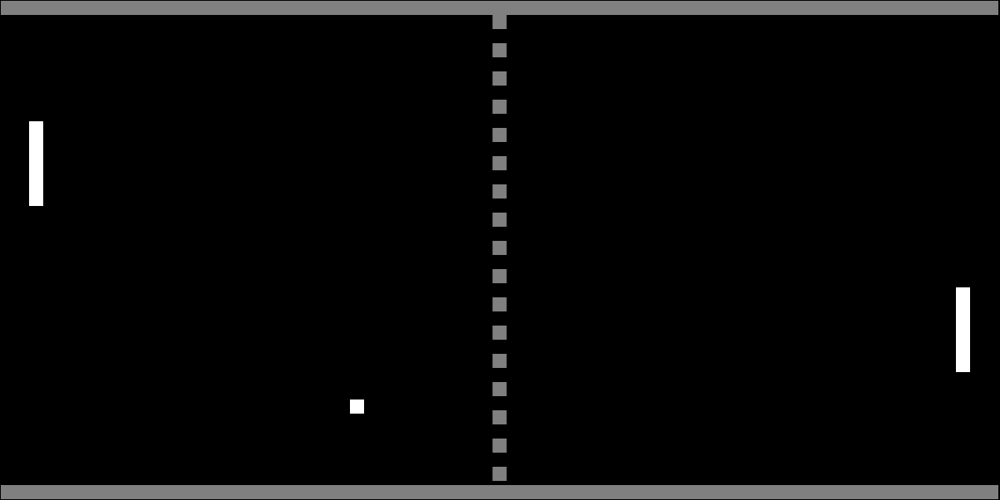

# Projekt E - Webová hra

## Zadání:
Napište program pro chod jednoduché webové hry, tedy hry, která poběží v okně webového prohlížeče.
Tvořit tak můžete například piškvorky, lodě, logickou hru miny, hru logik atp.
## Téma:
Téma a styl si můžete vybrat sami, je ale nutné, abych Vám jej schválil.
### Možný výsledek

> Pouze příklad
### Pragramovací jazyk:
PHP, HTML, CSS a JS

### Screenshoty hry:

